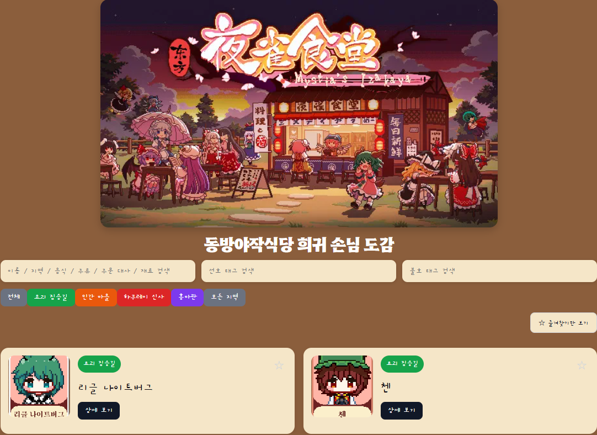
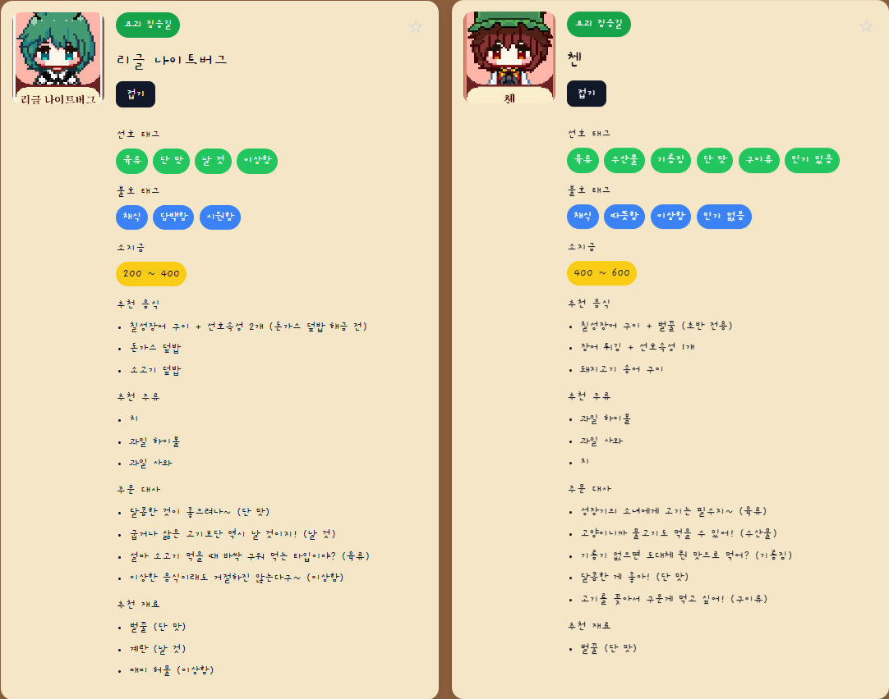
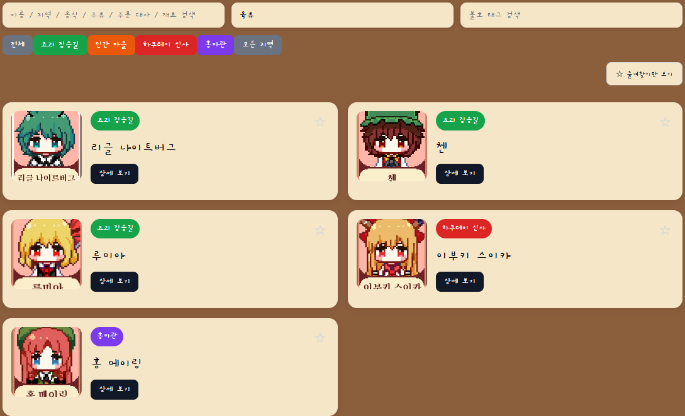

# 동방야작식당 희귀 손님 도감

> 게임 외부에서 희귀 손님 공략 정보를 빠르게 조회하기 위한 React 기반 도감 웹앱

🔗 **배포 링크**: [touhou-mistia-s-izakaya-pokedex.vercel.app](https://touhou-mistia-s-izakaya-pokedex.vercel.app)

---

## 스크린샷

| 메인 화면 | 상세 펼침 | 검색 결과 |
|:---------:|:---------:|:---------:|
|  |  |  |

---

## 프로젝트 소개

동방야작식당을 플레이하면서 희귀 손님의 선호/불호 태그, 추천 음식, 주문 대사 등을 게임 밖에서 빠르게 확인하기 어려웠습니다. 기존에 존재하는 정보들도 직관적으로 한눈에 보기 힘든 구조였고, 게임을 플레이하면서 바로 참고할 수 있는 도감이 필요하다고 느꼈습니다.

동방 프로젝트의 팬으로서, 그리고 타이쿤 장르를 좋아하는 플레이어로서 직접 만들어보고 싶다는 마음으로 시작한 첫 번째 개인 프로젝트입니다.

---

## 사용 기술

- **React** + **TypeScript**
- **CSS** (커스텀 스타일링)
- **localStorage** (즐겨찾기 상태 유지)
- **Vercel** (배포)

---

## 주요 기능

- 🔍 **통합 검색** — 이름, 지역, 음식, 주류, 주문 대사, 재료 등 **6개 필드** 통합 검색
- 🏷️ **태그 검색** — 선호/불호 태그 별도 검색, 통합 검색과 동시 적용 가능
- 🗺️ **지역 필터** — 5개 지역 버튼 필터 (요괴 짐승길 / 인간 마을 / 하쿠레이 신사 / 홍마관 / 모든 지역)
- ★ **즐겨찾기** — 자주 보는 손님 고정, localStorage로 새로고침 후에도 유지, 즐겨찾기 손님 상단 정렬
- 📋 **상세 보기** — 손님 1명당 선호/불호 태그, 소지금, 추천 음식, 추천 주류, 주문 대사, 추천 재료 **6가지 정보** 제공
- 🎴 **다중 카드 펼치기** — **14명** 손님 카드 동시 펼쳐서 비교 가능
- 🔗 **검색 + 태그 + 지역 + 즐겨찾기 필터 동시 적용** 가능

---

## 구현 중 신경 쓴 점

- **debounce 적용**: 타이핑할 때마다 검색이 즉시 실행되면서 초성 입력 중 화면이 요동치는 문제 발생 → 300ms debounce 적용으로 타이핑이 멈춘 후에만 검색 실행, UX 안정화
- **검색 정규화**: `인기있음`과 `인기 있음`처럼 공백 표기가 혼재할 경우 검색이 누락되는 문제 → 검색어와 데이터 양쪽 모두 공백 제거 후 비교하는 normalize 함수로 해결
- **컴포넌트/데이터 분리**: 초기엔 App.tsx에 타입, 데이터, UI가 모두 혼재 → `types/guest.ts`, `data/guests.ts`, `components/GuestCard.tsx`로 분리해 유지보수성 확보
- **즐겨찾기 정렬**: 즐겨찾기한 손님이 항상 목록 상단에 오도록 정렬, localStorage로 세션 간 상태 유지

---

## 앞으로 추가할 기능

- 다른 지역 손님 데이터 추가 (현재 4개 지역 **14명** 구현)
- DLC 손님 데이터 추가

---

## 프로젝트 구조

```
src/
├── assets/        # 이미지 파일
├── components/
│   └── GuestCard.tsx
├── data/
│   └── guests.ts
├── types/
│   └── guest.ts
├── App.tsx
└── App.css
```
